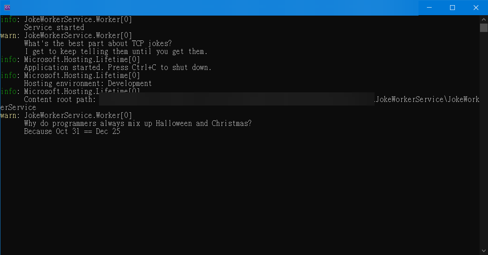
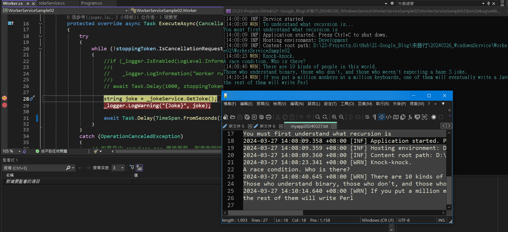
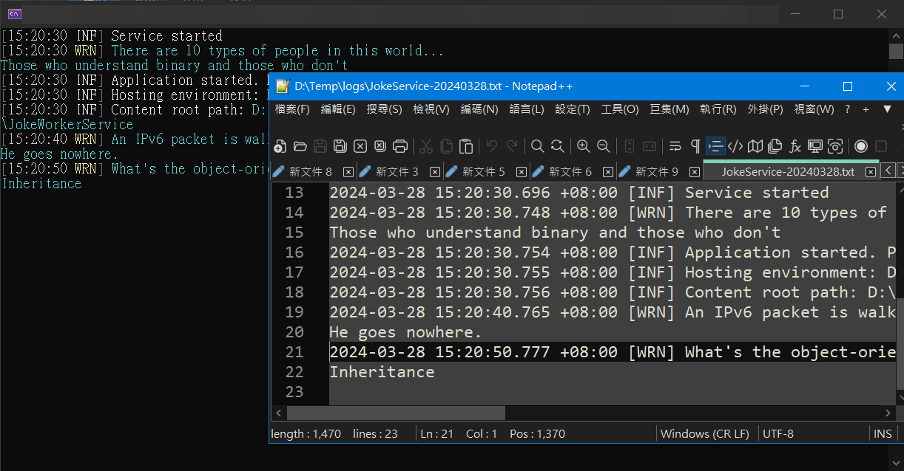
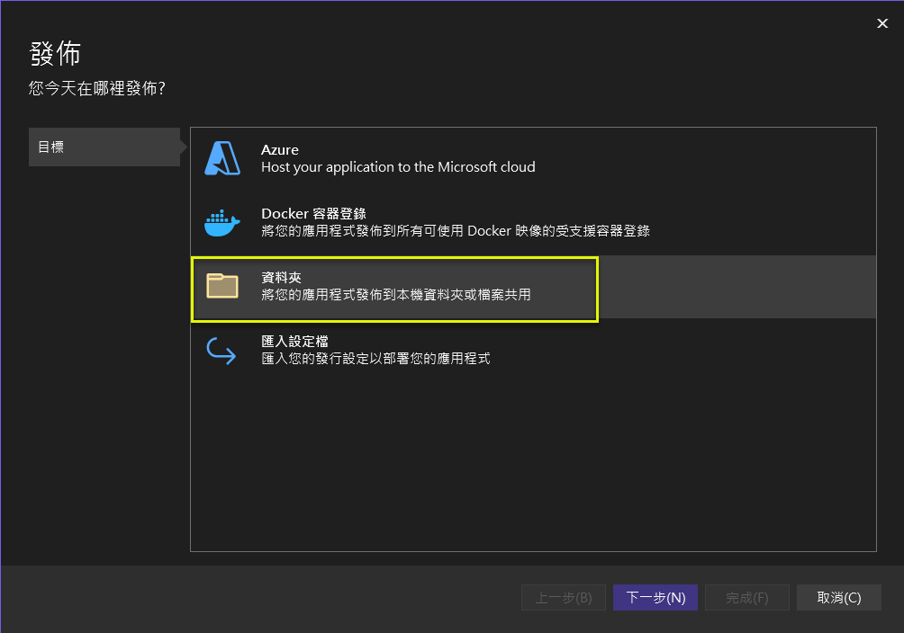
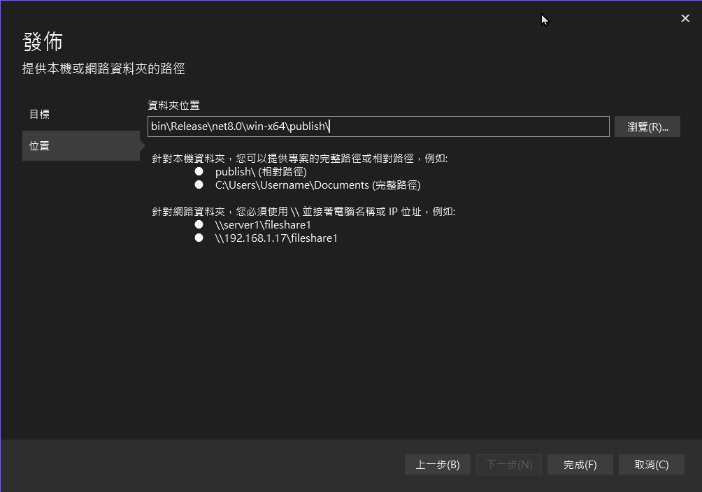
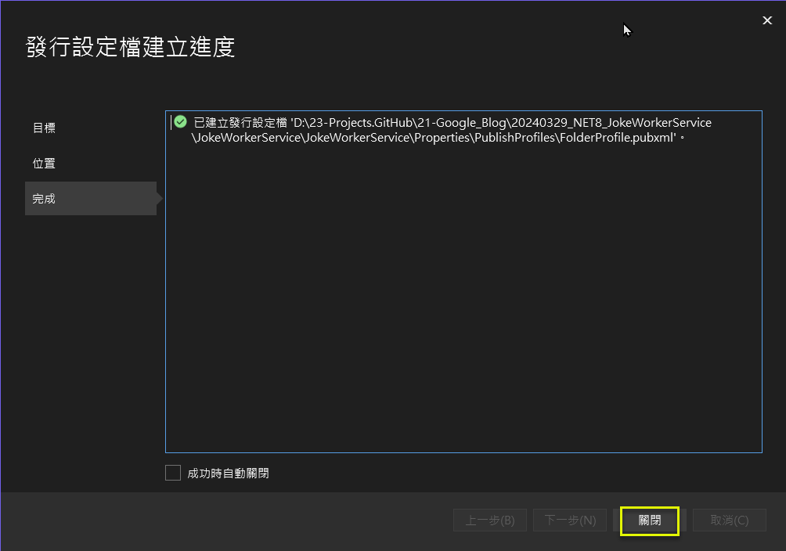
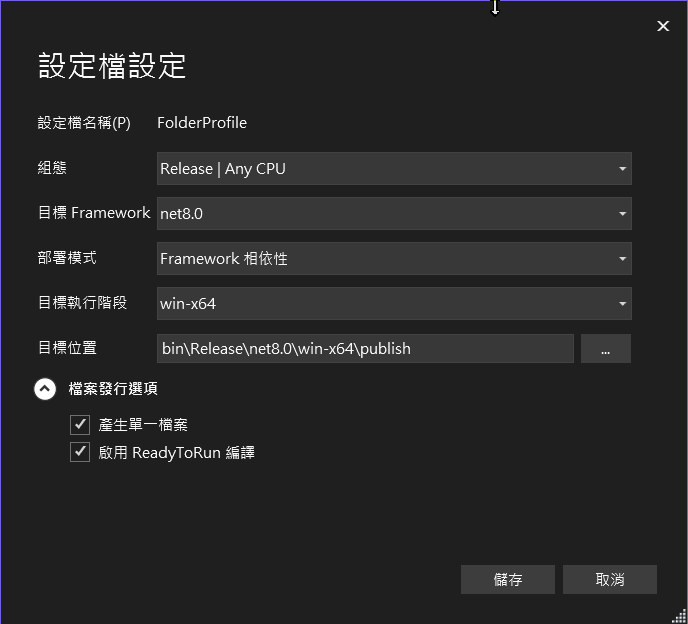
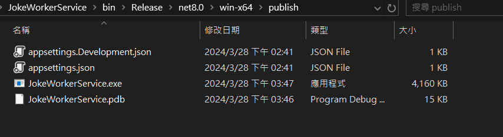
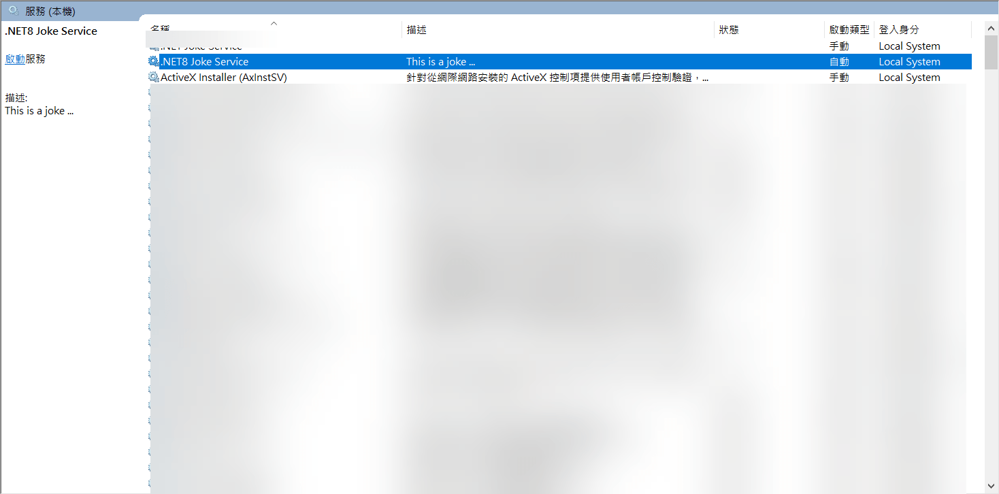

# 如何在 .NET 8 建立基於 BackgroundService 的 Windows Service 應用程式 (1)
## How to create Windows Service Application in .NET 8 by BackgroundService (1) 

這是一個參考 <a href="https://learn.microsoft.com/zh-tw/dotnet/core/extensions/windows-service" target="_blank">(Microsoft)(中文版) 使用 BackgroundService 建立 Windows 服務</a>  所作的演練.  

如同 <a href="https://blog.darkthread.net/blog/net6-windows-service/" target="_blank">(黑暗執行緒) 使用 .NET 6 開發 Windows Service</a> 所提到的, 可以同時支援 Console 及 Service 這 2 種執行模式真的很不錯. 不然以往都要切 3 個 C# 專案: 核心 Library, Console, Windows Service. 
* Library: 程式邏輯核心.  
* Console: 是為了偵錯用.  
* Windows Service: 是為了部署上線用.  

以下為章節列表.  

一. [開發過程](#section1)  
二. [採用 Serilog 輸出至 Console 及 File](#section2)  
三. [以 Console 模式執行](#section3)  
四. [以 Windows Service 模式執行](#section4)  

<!-- more -->  

## 一. 開發過程 <a id="section1"></a>

1.. 以 dotnet CLI 或 Visual Studio 2022 建立 "背景工作服務" 專案.  
```powershell
dotnet new worker --name JokeWorkerService
```

2.. 加入 nuget 套件: Microsoft.Extensions.Hosting.WindowsServices  
```powershell
dotnet add package Microsoft.Extensions.Hosting.WindowsServices
```

3.. 修改 .csproj: 設定專案發行時的組態.    
```xml
<OutputType>exe</OutputType>
<PublishSingleFile Condition="'$(Configuration)' == 'Release'">true</PublishSingleFile>
<RuntimeIdentifier>win-x64</RuntimeIdentifier>
<PlatformTarget>x64</PlatformTarget>	  
```
* &lt;OutputType&gt;exe&lt;/OutputType&gt;: 建立主控台應用程式 (Console Application).  
* &lt;PublishSingleFile Condition="'$(Configuration)' == 'Release'"&gt;true&lt;/PublishSingleFile&gt;: 啟用單一檔案發佈.  
* &lt;RuntimeIdentifier&gt;win-x64&lt;/RuntimeIdentifier&gt;: 指定 win-x64 的 <a href="https://learn.microsoft.com/zh-tw/dotnet/core/rid-catalog" target="_blank">RID</a>.
* &lt;PlatformTarget&gt;x64&lt;/PlatformTarget&gt;: 指定 64 位元的目標平台 CPU.

4.. 建立服務: JokeService

```csharp
public sealed class JokeService
{
    public string GetJoke()
    {
        Joke joke = _jokes.ElementAt(
            Random.Shared.Next(_jokes.Count));

        return $"{joke.Setup}{Environment.NewLine}{joke.Punchline}";
    }

    // Programming jokes borrowed from:
    // https://github.com/eklavyadev/karljoke/blob/main/source/jokes.json
    private readonly HashSet<Joke> _jokes =
    [
        new Joke("What's the best thing about a Boolean?", "Even if you're wrong, you're only off by a bit."),
        new Joke("What's the object-oriented way to become wealthy?", "Inheritance"),
        new Joke("Why did the programmer quit their job?", "Because they didn't get arrays."),
        new Joke("Why do programmers always mix up Halloween and Christmas?", "Because Oct 31 == Dec 25"),
        new Joke("How many programmers does it take to change a lightbulb?", "None that's a hardware problem"),
        new Joke("If you put a million monkeys at a million keyboards, one of them will eventually write a Java program", "the rest of them will write Perl"),
        new Joke("['hip', 'hip']", "(hip hip array)"),
        new Joke("To understand what recursion is...", "You must first understand what recursion is"),
        new Joke("There are 10 types of people in this world...", "Those who understand binary and those who don't"),
        new Joke("Which song would an exception sing?", "Can't catch me - Avicii"),
        new Joke("Why do Java programmers wear glasses?", "Because they don't C#"),
        new Joke("How do you check if a webpage is HTML5?", "Try it out on Internet Explorer"),
        new Joke("A user interface is like a joke.", "If you have to explain it then it is not that good."),
        new Joke("I was gonna tell you a joke about UDP...", "...but you might not get it."),
        new Joke("The punchline often arrives before the set-up.", "Do you know the problem with UDP jokes?"),
        new Joke("Why do C# and Java developers keep breaking their keyboards?", "Because they use a strongly typed language."),
        new Joke("Knock-knock.", "A race condition. Who is there?"),
        new Joke("What's the best part about TCP jokes?", "I get to keep telling them until you get them."),
        new Joke("A programmer puts two glasses on their bedside table before going to sleep.", "A full one, in case they gets thirsty, and an empty one, in case they don’t."),
        new Joke("There are 10 kinds of people in this world.", "Those who understand binary, those who don't, and those who weren't expecting a base 3 joke."),
        new Joke("What did the router say to the doctor?", "It hurts when IP."),
        new Joke("An IPv6 packet is walking out of the house.", "He goes nowhere."),
        new Joke("3 SQL statements walk into a NoSQL bar. Soon, they walk out", "They couldn't find a table.")
    ];
}
```

5.. 修訂 Worker.cs: 

摘要:  
注入 JokeService, 並在 ExecuteAsync() 呼叫 _jokeService.GetJoke() 方法  

部份程式說明:  
(1) Worker 類別繼承自 BackgroundService 類別.  
(2) 覆寫 ExecuteAsync() 方法.  
(3) ExecuteAsync() 方法會在基底 BackgroundService 類別的 StartAsync() 呼叫.  

```csharp
public class Worker : BackgroundService
{
    private readonly ILogger<Worker> _logger;
    private readonly JokeService _jokeService;

    public Worker(ILogger<Worker> logger, JokeService jokeService)
    {
        _logger = logger;
        _jokeService = jokeService;
    }

    protected override async Task ExecuteAsync(CancellationToken stoppingToken)
    {
        try
        {
            while (!stoppingToken.IsCancellationRequested)
            {
                //if (_logger.IsEnabled(LogLevel.Information))
                //{
                //    _logger.LogInformation("Worker running at: {time}", DateTimeOffset.Now);
                //}
                // await Task.Delay(1000, stoppingToken);

                string joke = _jokeService.GetJoke();
                _logger.LogWarning("{Joke}", joke);

                await Task.Delay(TimeSpan.FromSeconds(10), stoppingToken);
            }
        }
        catch (OperationCanceledException)
        {
            // 如果是由 services.msc 停掉服務, 則會跑到這個 OperationCanceledException
            // 這算是正常的操作, 不應該擲回非 0 的 exit code.
        }
        catch (Exception ex)
        {
            _logger.LogError(ex, "{Message}", ex.Message);

            // In order for the Windows Service Management system to leverage configured
            // recovery options, we need to terminate the process with a non-zero exit code.
            Environment.Exit(1);
        }
    }

    /// <summary>
    /// 服務啟動時
    /// </summary>
    /// <param name="stoppingToken">The stopping token.</param>
    public override async Task StartAsync(CancellationToken stoppingToken)
    {
        _logger.LogInformation("Service started");
        // 基底類別 BackgroundService: 在 StartAsync() 呼叫 ExecuteAsync、
        await base.StartAsync(stoppingToken);
    }

    /// <summary>
    /// 服務停止時
    /// </summary>
    /// <param name="stoppingToken">The stopping token.</param>
    public override async Task StopAsync(CancellationToken stoppingToken)
    {
        _logger.LogInformation("Service stopped");
        // 基底類別 BackgroundService: 在 StopAsync() 時呼叫 stoppingToken.Cancel() 優雅結束
        await base.StopAsync(stoppingToken);
    }
}
```

```csharp
public abstract class BackgroundService : IHostedService, IDisposable
{
	private Task? _executeTask;
	private CancellationTokenSource? _stoppingCts;

	/// Gets the Task that executes the background operation.
	public virtual Task? ExecuteTask => _executeTask;

	/// This method is called when the <see cref="IHostedService"/> starts. The implementation should return a task that represents
	/// the lifetime of the long running operation(s) being performed.
	protected abstract Task ExecuteAsync(CancellationToken stoppingToken);

	/// Triggered when the application host is ready to start the service.
	public virtual Task StartAsync(CancellationToken cancellationToken)
	{
		// Create linked token to allow cancelling executing task from provided token
		_stoppingCts = CancellationTokenSource.CreateLinkedTokenSource(cancellationToken);

		// Store the task we're executing
		_executeTask = ExecuteAsync(_stoppingCts.Token);

		// If the task is completed then return it, this will bubble cancellation and failure to the caller
		if (_executeTask.IsCompleted)
		{
			return _executeTask;
		}

		// Otherwise it's running
		return Task.CompletedTask;
	}
	
    // (省略) 以下原始程式碼
}
```

6.. 修訂 Program.cs:

摘要:  
(1) builder.Services.AddWindowsService(...): AddWindowsService 擴充方法會設定應用程式如 Windows 服務般運作. 服務名稱設為 ".NET8 Joke Service".  
(2) builder.Services.AddSingleton&lt;JokeService&gt;(): 將 JokeService 註冊到 DI container.  

```csharp
using WorkerServiceSample02;

var builder = Host.CreateApplicationBuilder(args);

// 這是為了要以 Windows Service 模式執行.
// 但如果沒有註冊到 "服務", 仍然是以 Console 模式執行.
builder.Services.AddWindowsService(options =>
{
    options.ServiceName = ".NET8 Joke Service";
});

builder.Services.AddSingleton<JokeService>();
builder.Services.AddHostedService<Worker>();

var host = builder.Build();
host.Run();
```

7.. 在 VS 2022 小試一下, 看來正常.  
  

## 二. 採用 Serilog 輸出至 Console 及 File <a id="section2"></a>

由於 Windows Event Log 真的不是很 user friendly (可能筆者沒有很深入研究 Event Log 吧 ^^).  
故採用 Serilog 輸出至 Console 及 File.  

1.. 加入相關的 nuget 套件.  
* Serilog "3.1.1"
* Serilog.Sinks.Console "5.0.1"
* Serilog.Sinks.File "5.0.0"
* Serilog.Extensions.Hosting "8.0.0"

2.. 修訂 Program.cs.  
加入 "設置 Serilog" 及 "採用 Serilog 作為 Log 的工具" 這 2 個程式段.  

**重要:**  
**原本設定的 Log 檔為 "logs/JokeService-yyyyMMdd.txt", 預設在 logs 資料夾下; 但經實測, 會依執行方式, 而有不同的位置.**  

* 在 VS2022 偵錯: logs 資料夾與 bin 資料夾同一層.  
* 在檔案總管 double-click .exe: logs 資料夾位於 .exe 的下一層.  
* 部署為 Windows Service: logs 資料夾位於 "C:\Windows\System32" 資料夾下.  

**為了避免 log 檔案位置不一致, 改為固定在 D:/Temp/logs/ 之下. 但這樣就只能限制執行平台是 Windows 了.**  

```csharp
using Serilog;
using WorkerServiceSample02;

#region 設置 Serilog 
Log.Logger = new LoggerConfiguration()
    .MinimumLevel.Information()
    .WriteTo.Console()
    //.WriteTo.File("logs/JokeService-.txt", rollingInterval: RollingInterval.Day)
    .WriteTo.File("D:/Temp/logs/JokeService-.txt", rollingInterval: RollingInterval.Day)
    .CreateLogger(); 
#endregion

var builder = Host.CreateApplicationBuilder(args);

#region 採用 Serilog 作為 Log 的工具
// Configure your application
builder.Logging.ClearProviders(); // Clear default logging providers
builder.Logging.AddSerilog(); // Use Serilog for logging
#endregion

// 這是為了要以 Windows Service 模式執行.
// 但如果沒有註冊到 "服務", 仍然是以 Console 模式執行.
builder.Services.AddWindowsService(options =>
{
    options.ServiceName = ".NET8 Joke Service";
});

builder.Services.AddSingleton<JokeService>();
builder.Services.AddHostedService<Worker>();

var host = builder.Build();
host.Run();
```

## 三. 以 Console 模式執行 <a id="section3"></a>
以 Console 的方式執行, 係指在 Visual Studio 2022 或在檔案總管 double-click \bin\Debug\net8.0\win-x64\JokeWorkerService.exe.  

### (一) 在 Visual Studio 2022 可以偵錯 (按 [F5])
  

### (二) 在檔案總管 double-click JokeWorkerService.exe 可以直接執行
  

## 四. 以 Windows Service 模式執行 <a id="section4"></a>
### (一) 發行為單一的 .exe 檔

**1.. [方式1] 使用 Visual Studio 2022 發佈 (publish)**  
  
  
  
  


**2.. [方式2] 使用 dotnet CLI**  
使用 dotnet publish -c Release -r win-x64 --no-self-contained -p:PublishSingleFile=true 編譯成單一 .exe 檔.  

以**系統管理員身份**, 在 Visual Studio 2022 Developer Command Prompt 執行以下指令.  

```powershell
D:\Temp\JokeWorkerService> dotnet publish -c Release -r win-x64 --no-self-contained -p:PublishSingleFile=true
.NET 的 MSBuild 版本 17.9.6+a4ecab324
  正在判斷要還原的專案...
  已還原 
  ...\JokeWorkerService\bin\Release\net8.0\win-x64\publish\

D:\Temp\JokeWorkerService> dir bin\Release\net8.0\win-x64\publish
2024/03/28  下午 02:41               137 appsettings.Development.json
2024/03/28  下午 02:41               137 appsettings.json
2024/03/28  下午 03:52         2,753,223 JokeWorkerService.exe
2024/03/28  下午 03:52            15,044 JokeWorkerService.pdb
```

3.. 請留意: 前述的 VS 2022 發佈 (約 4MB), 跟 dotnet CLI 發佈 (約 2MB) 的差異, 在於是否有 [V] 啟用 ReadyToRun 編譯. dotnet CLI 那串指令, 等同沒有打 V 啟用 ReadyToRun 編譯.  

### (二) 註冊及啟動 

1.. 複製所有發行的檔案, 至 Windows Service 所在的資料夾.  
```powershell
D:\Temp\JokeWorkerService> copy bin\Release\net8.0\win-x64\publish\*.* D:\Temp\publish\JokeWorkerService
```

2.. 建立 Windows Service, 並設為自動啟動, 且給予描述.  
```powershell
D:\Temp\JokeWorkerService> cd "D:\Temp\publish\JokeWorkerService"

D:\Temp\publish\JokeWorkerService>sc create ".NET8 Joke Service" binpath="D:\Temp\publish\JokeWorkerService\JokeWorkerService.exe" start=auto
[SC] CreateService 成功

D:\Temp\publish\JokeWorkerService>sc description ".NET8 Joke Service" "This is a joke ..."
[SC] ChangeServiceConfig2 成功
```

對照一下 "服務" 裡的狀況, 確定有註冊成功, 且為自動啟動.


3.. 啟動服務.  
```powershell
D:\Temp\publish\JokeWorkerService>sc start ".NET8 Joke Service"
SERVICE_NAME: .NET Joke Service
        TYPE               : 10  WIN32_OWN_PROCESS
        STATE              : 2  START_PENDING
                                (NOT_STOPPABLE, NOT_PAUSABLE, IGNORES_SHUTDOWN)
        WIN32_EXIT_CODE    : 0  (0x0)
        SERVICE_EXIT_CODE  : 0  (0x0)
        CHECKPOINT         : 0x0
        WAIT_HINT          : 0x7d0
        PID                : 31204
        FLAGS              :
```

4.. 停止服務.  
```powershell
D:\Temp\publish\JokeWorkerService>sc stop ".NET8 Joke Service"
SERVICE_NAME: .NET Joke Service
        TYPE               : 10  WIN32_OWN_PROCESS
        STATE              : 3  STOP_PENDING
                                (STOPPABLE, NOT_PAUSABLE, ACCEPTS_SHUTDOWN)
        WIN32_EXIT_CODE    : 0  (0x0)
        SERVICE_EXIT_CODE  : 0  (0x0)
        CHECKPOINT         : 0x0
        WAIT_HINT          : 0x0
```

5.. 刪除服務.  
```powershell
D:\Temp\publish\JokeWorkerService>sc delete ".NET8 Joke Service"
[SC] DeleteService 成功
```

## 參考文件

* <a href="https://blog.darkthread.net/blog/net6-windows-service/" target="_blank">(黑暗執行緒) 使用 .NET 6 開發 Windows Service</a>  
* <a href="https://blog.darkthread.net/blog/dotnet6-publish-notes/" target="_blank">(黑暗執行緒) 使用 dotnet 命令列工具發行 .NET 6 專案</a>  

* <a href="https://learn.microsoft.com/zh-tw/dotnet/core/extensions/windows-service" target="_blank">(Microsoft)(中文版) 使用 BackgroundService 建立 Windows 服務</a>  
* <a href="https://learn.microsoft.com/en-us/dotnet/core/extensions/windows-service" target="_blank">(Microsoft)(英文版) Create Windows Service using BackgroundService</a>  
* <a href="https://github.com/dotnet/samples/tree/main/core/workers" target="_blank">(Microsoft)(英文版) Sample Source in GitHub</a>  

